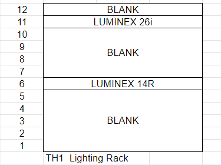
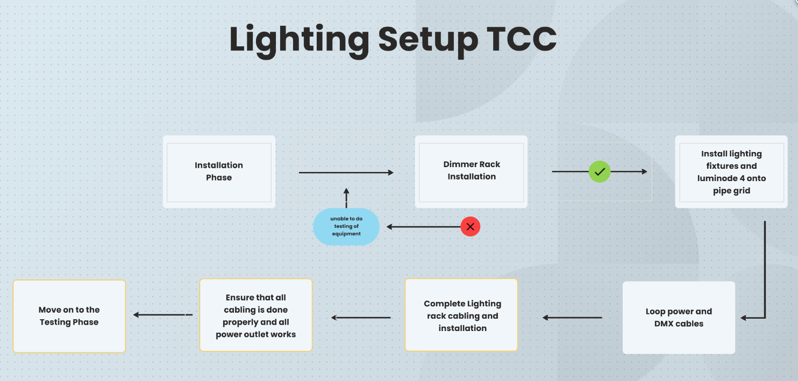

# ITP_Lighting

## Project Background
This project is a church project that involves installation of AV systems(Audio, Video, Lighting, Control).
The installation of AV systems is under Electronics & Engineering (E&E), an SI company that deals with Audio Visual Technology.

## What is this for?
This github is created for a more detailed and step by step manual for the lighting setup done in this project.

**Note:**
*Please note that this github is mainly created for a presentation. Please do not use it illegally. Thank you for your co-operation.*

---

## Table of Content :

- **[Design Phase](#design-phase)**
- **[Installation Phase](#installation-phase)**
- **[Testing Phase](#testing-phase)**
- **[Controls](#controls)**

---

## Design Phase
**[(Back To Top)](#table-of-content-)**

The design phase is the "planning stage". Together with the clients and consultants, the company comes out with the desired 
layout, the list of equipment to use, as well as the schematics for the equipment used.

**Below are examples a rack layout and schematics of one room in this project:**


**Theatrette 1 Lighting Rack Layout**


<br>

---
**Theatrette 1 Lighting Schematics**

---

```mermaid

flowchart LR

   A[GrandMA 3] -- LAN --> B[Network Switch (1)]
   B -- LAN --> C[Network Switch (2)]
   C -- LAN --> D(Luminode 4(1))
   D -- LAN --> E(Sensor 3(Dimmer Rack))
   B -- LAN --> F(Luminode 4(2))
   B -- LAN --> G(Luminode 4(3))
   B -- LAN --> H(Luminode 4(4))
   B -- LAN --> I(Luminode 4(5))
   B -- LAN --> J(Luminode 4(6))
   B -- LAN --> K(Luminode 4(7))
   F -- DMX --> L(Lighting Fixtures)
   J -- DMX --> M(Lighting Fixtures)
   K -- DMX --> N(Lighting Fixtures)
```

**Note:** 
In case of company secrecy, not actual drawings or schematics will be posted.
Instead, above is a flow chart to roughly show the connection of the lighting setup done in this project.

---
## Installation Phase
**[(Back To Top)](#table-of-content-)**

The next stage is installation of equipment. 

**Here's a simple flow chart of what to take note when installing your equipment:**



<br>

**Note:**
Other than the required equipment, the electrcial side plays apart too. So knowing the appropriate power outlet and supply, where the incoming power is and so on is important too. However if it's on a small scale basis, it is not much of a problem.


## Testing Phase
**[(Back To Top)](#table-of-content-)**

After the equipment has been installed, we can now test our equipment.

### Dimmer Rack

1) Have your tools ready. Make sure that you at least have a working multimeter, torch light and screwdriver(both +ve & -ve).

2) Make sure that all incoming power is off. 

3) Now take out all modules if its still in the dimmer rack. Now you can start testing the rack with a working multimeter.


In the dimmer rack, there are 3 Phases, Live, Earth and Neutral Cables. To test for the dimmer rack, we have to test both open and close cicruit to ensure that there is no power leakage and the appropriate resistance when testing.

#### Open Circuit

When in an open cicruit, no power should be going through and resistance should be in the range of 0 - 10 Ohms.
OL(Open Line) will appear on the multimeter if its correct.

#### What to test/check?

To start off, we start by testing one phase to another. 

E.g. Phase A to Phase B

1) Step 1

Phase to Phase

Phase to Live

Phase to Neutral 

Phase to Earth

2) Step 2

The same goes for testing netural, live and earth.

Live to Live

Live to Neutral

.
.

Neutral to Neutral

Neutral to Earth

.
.

Earth to Earth

Earth to Live

.
.

3) Step 3

Once you have tested that there is no current when dimmer rack is off and resistance is within 0-10 ohms,
insert the processor for the dimmer rack. Check that processor is also in an open circuit before inserting into the dimmer rack.

4) Step 4

Once you have inserted the processor, you may switch on the dimmer rack power.

5) Step 5

Test for dimmer rack power and endure that when power is on, the range should be:

*For Phase to Phase - 450V*

*For Phase to live/neutral/earth - 230V*

6) Step 6

As rack is on, both Fan and processor should be working and swtiched on.

### To Note for Dimmer Rack

- Plates in the dimmer rack should not be rusty (can affect the contact when testing)
- Make sure there should not be any current leaking when power is off
- Make sure that when power is off, it should be an open circuit
- Check for lose cabling
- Dimmer rack Fan should be spinning as intended
- Dimmer rack should always be kept clean and should not be dusty

### Processor (Dimmer rack)

1) To configure the processor, ensure that the rack is switched on.
2) You may either use the built in UI or an application called ETC concert to help in your configuration.
3) For bulit in UI:
    * Click on the Setup Button
    * To change IP Address and subnet, select "Network". And once done click "Commit" to save the details.
    * To ensure that sACN is selected and DMX port is open , you can Select "Rack" to check the details.

4) For ETC Concert:
    * Download the application from the ETC website
    * Open up the application, and find the File tab and click on new project
    * Find the Device Library section. In that section find the Power Controllers tab. 
    * Now find the dimmer rack that you are using and drag it into the world view section.
    * You may either go to the Property editor or when drag dimmer to World View, check that the Network settings is correct.
    * Make sure that your IP and Gateway address and the subnet tallies with the supposed dimmer rack.
    * Next, check that rack model tally with the rack model you are using. If it is not, change the rack model to its supposed model.
    * Double click the dimmer rack icon in the World View. Go to the Porperties section, check that the module type is correct.
    * In the same Properties section, check the other properties and enable whatever has to be enabled or changed.
    * Save the file

### Software Applications 

#### sACNView

We use this application to ensure that sACN is going though the modules when the signal bar in the modules lights up. 

Click on the link below to find out more on how to use this application:

<https://support.etcconnect.com/ETC/Consoles/Eos_Family/Software_and_Programming/Using_the_Eos_sACN_Output_Viewer>

#### ETC Concert

We Use this application to help in configurating the processor as well as check if dimmer rack properties are correct.

Click the link below to download the application:

<https://www.etcconnect.com/Products/Networking/System-Configuration/Software/Concert.aspx>


## Controls
**[(Back To Top)](#table-of-content-)**

### Configuring

1) Ensure that all IP Address for your console, all nodes and dimmer rack are in the same class. All subnet masks should be the same.

2) Check that all necessary connections have been made. E.g. console LAN to network switch. 

#### Console

3) Turn on your console, and rename and save your show file.

4) Now find the "Menu" button, click on it. In that small interface, click on patch.

5) Start by coming out with a patch list for your dimmer rack and fixtures.

6) Once done patching, save and exit. Go back to the small interface, and click on Network.

7) Ensure that your console IP and subnet are correct. If so, find the power icon and click on it to start the session.

8) Now go back to the small interface, and click on DMX protocols. We will be focusing on sACN as the dimmer rack uses sACN only. 

9) Click on the sACN tab and the top left corner. 

10) Now enable sACN selecting YES. Turn on, enable output, enable send sACN if idlemaster and enable setup mode.

11) Save your file once done.

#### Luminode 4 & Network Switch

12) Download the Araneo application by luminex

13) Connect your laptop to the network switch and open the application.

14) In the application click on "Online Mode" to see all connected luminex devices.

15) You can type the IP Address of the device directly if you know the specific IP or use the application to help you locate.

16) Click on any device and there will be a few options to chose from.

17) If you want to change the IP Address and subnet mask, click on "Web UI" and then in the Interface, click on "Network.

18) For luminode 4, for easy change of what output you want, click on "Toolbox" and in the drop down menu select what you want.

19) Once selected, Click on "Recall".


#### Configuring the universes in Luminode

* In order to control the fixtures, you will need to key in the universes accordingly according to your patch
* So if you patch universe 2 for one set of lighting fixtures, the port the fixtures are connected to has to be 2.